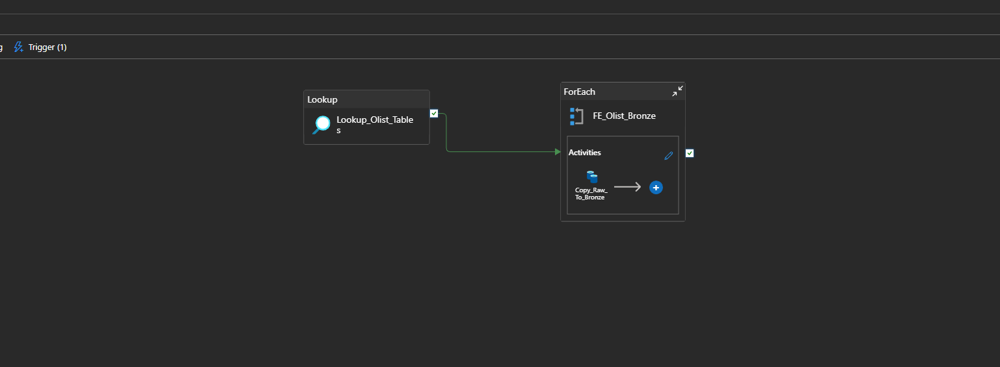

# Azure Databricks Lakehouse Project (Medallion Architecture)

## Project Overview
This project demonstrates an end-to-end data engineering pipeline built on Microsoft Azure using the Medallion Architecture (Bronze → Silver → Gold).

The pipeline ingests raw data into Azure Data Lake, processes it using Azure Databricks with Delta Lake, and orchestrates ingestion using Azure Data Factory with scheduled triggers.

The goal is to create analytics-ready datasets following real-world data engineering best practices.

## Pipeline Metrics & Scale

- Total source datasets: 3 (orders, customers, order_items)
- Total records processed:
  - Orders: ~99K rows
  - Customers: ~99K rows
  - Order Items: ~112K rows
- Total Silver tables: 3
- Total Gold tables: 2
- Data format: Delta Lake (Parquet-based)
- Incremental processing: Watermark-based (timestamp)
- Orchestration frequency: Daily (ADF Schedule Trigger)
- Storage layers: Bronze → Silver → Gold

---

## Architecture Overview

- Source: CSV files (simulated raw data)
- Orchestration: Azure Data Factory (ADF)
- Storage: Azure Data Lake Storage Gen2
- Processing: Azure Databricks
- Format: Delta Lake
- Architecture Pattern: Medallion (Bronze / Silver / Gold)

---

## Performance & Optimization

- Delta Lake used for ACID transactions and schema enforcement
- Z-ORDER optimization applied on Gold fact tables
- Small file compaction using OPTIMIZE
- Append-only incremental writes to minimize reprocessing

## Data Flow

### Bronze Layer
- Raw data ingested using ADF Copy activity
- Stored as-is in ADLS Bronze container
- Triggered daily using ADF Schedule Trigger

### Silver Layer
- Data cleansing and standardization
- Schema enforcement
- Incremental loads using watermark logic
- Stored as Delta tables in Databricks

### Gold Layer
- Business-ready fact and dimension tables
- Optimized using Z-ORDER
- Designed for analytics and reporting

---

## Incremental Processing Strategy

- Watermark based on `order_purchase_timestamp`
- Only new records processed on subsequent runs
- Append strategy used for Silver and Gold layers

---

## Orchestration & Automation

- Metadata-driven ADF pipeline
- Lookup activity fetches table list
- ForEach loop processes multiple datasets
- Daily schedule trigger enabled

---

## Key Learnings
- Building metadata-driven pipelines in ADF
- Implementing Medallion Architecture
- Incremental data processing in Databricks
- Delta Lake optimization techniques
- End-to-end Azure data engineering workflow

---

## Future Enhancements
- Slowly Changing Dimensions (SCD Type 2)
- Azure Synapse Analytics
- Power BI semantic model
- CI/CD with Azure DevOps

